# Stereo Light
---

## Introduction

This branch mainly covers the processing and usage of [stereo light camera](.github/assets/stereo_light_system.png). It involves three tasks:

1. Stereo Light for depth estimation. This is done by stereo matching and triangulation.

2. Camera pose estimation. This is done by using the decoded depth map and the camera intrinsics.

3. Evaluation of the estimated depth and restored camera pose. This is done by rerender the right image and warp the left image, then compare with the original image.

All the tasks here follows setting:

1. Known: 
    - intrinsics of the left, right camera, and the projector.
    - The pose of the projector (R and T) relative to the left camera.

2. Unknown:
    - The pose of the right camera relative to the left camera.

## How to Use this Repository

First, unzip the data files:
```
$ unzip data.zip
```

Second, run the `main.py` to go through the three tasks:
```
$ python main.py
```

If you have some missing packages, just pip install them and re-run the `main.py`.

## Task 1: Monocular Structured-Light Decoding
0. Task Details: In the stereo system composed of the left camera and the projector (the projector can be regarded as a camera), do:

    1) The provided structured-light images are in color. You may first convert all images except the RGB ones to grayscale.

    2) Perform epipolar rectification. Note that after rectification, you need to crop out regions not covered by the projected pattern. The camera image and the projected pattern must undergo exactly the same cropping, and the intrinsics should be adjusted accordingly after cropping.

    3) Stereo matching: on the rectified camera image and projector pattern (under the single_shot condition), perform matching along the same row to estimate the disparity disp.

    4) Triangulation: depth is computed as $$ d = f \times \frac{b}{disp} $$ where $f$ is the first element of the intrinsic matrix, and $b$ is the baseline distance.

    5) The object-level dataset provides 32 images captured with alacarte stripe patterns and their corresponding projected patterns. Combining the 32 images yields a special 32-channel image for each pixel, which is very easy to match. Use the alacarte stripe images to recompute disp and depth, and compare the results with those under the single-shot condition.


1. Implement Details：
    - First, use the functions provided by cv2 to perform rectification and cropping on the left camera image and the projector image.
        ```python
        # stereoRectify
        R1, R2, P1, P2, Q, _, _ = cv2.stereoRectify(
        KL, DL, KP, DP, (w, h), R, T, flags=cv2.CALIB_ZERO_DISPARITY, alpha=alpha)

        # maps
        map1x, map1y = cv2.initUndistortRectifyMap(KL, DL, R1, P1, (w, h), cv2.CV_32FC1)
        map2x, map2y = cv2.initUndistortRectifyMap(KP, DP, R2, P2, (w, h), cv2.CV_32FC1)

        left_rect = [cv2.remap(img, map1x, map1y, interpolation=cv2.INTER_LINEAR) for img in left_img_list]
        right_rect = [cv2.remap(img, map2x, map2y, interpolation=cv2.INTER_LINEAR) for img in right_img_list]
        ```
    - Then, I implemented my own row-wise matching algorithm, using ZNCC as the cost function to compute the disparity.

    - Third, use the triangulation formula to obtain the depth.

    - Finally, remap the depth obtained in the rectified camera coordinates back to the original camera pose, i.e., perform one rotation transformation (pseudocode below):
        ```python
        pixel_orig = pcd @ R1 @ meta["KL"].T
        pixel_orig[:, :2] /= pixel_orig[:, 2:]
        depth_orig[pixel_orig[:, 1], pixel_orig[:, 0]] = pixel_orig[:, 2][pixel_mask]
        ```

2. Depth decoded using the single-shot image (the depth below is generated from single shot image No. 1):

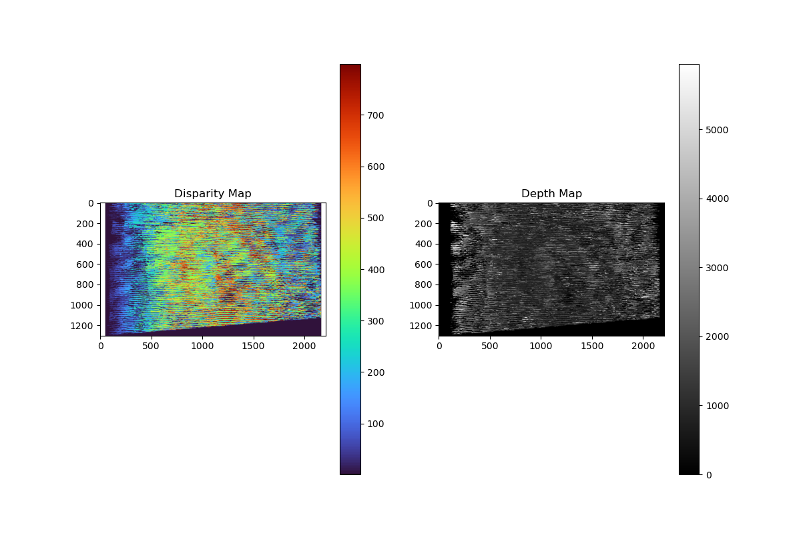

3. Depth decoded using the 32 alacarte images concatenated as features, which is clearly better than the single-shot result:

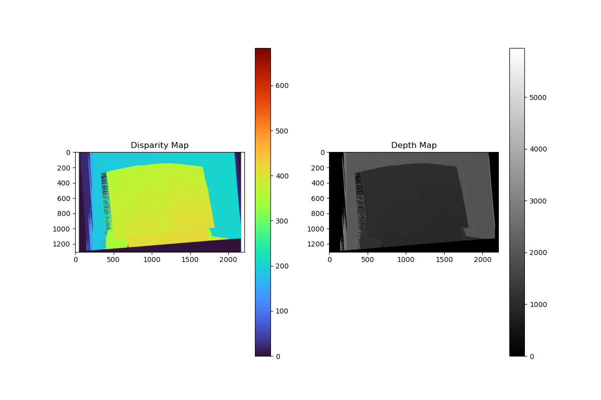

4. Depth decoded for the other two objects in the alacarte image:

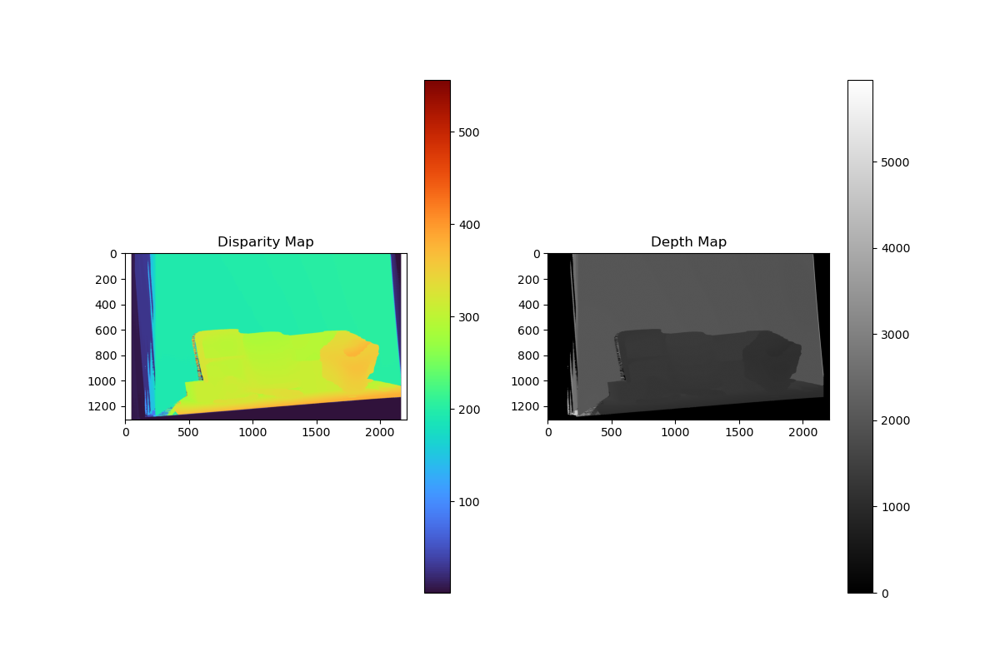
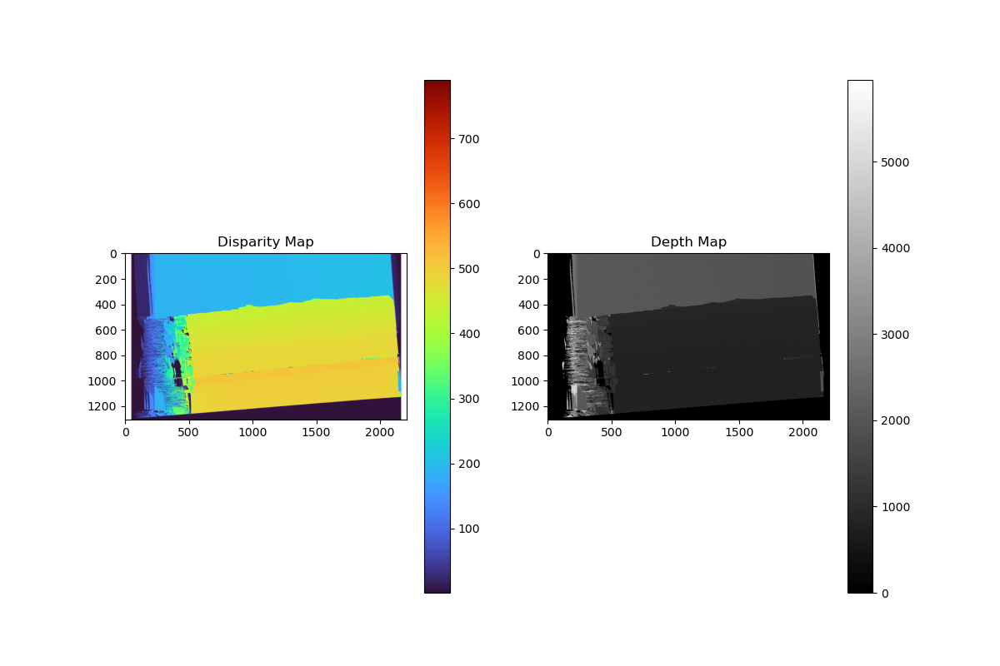


## Task 2: Right Camera Pose Estimation
0. Task Details: After completing Step 1 (depth estimation), the per-pixel depth of the left camera is known, meaning the 3D position of each pixel is available. In the stereo system composed of the left and right cameras, perform the following:

    1) Similarly crop the right-camera image, keeping only the region covered by the projection to facilitate matching.

    2) Feature-point matching. Match feature points between the left and right cameras; this can be dense or sparse. The goal here is not to estimate disparity, but to use the matched points for pose estimation.

    3) For each matched point pair, since the 3D position of the point is already known from Step 1, this forms a 3D–2D correspondence. Methods such as PnP (Perspective-n-Point) can be used to solve for the right camera’s pose.

    4) Re-estimate the right-camera pose using the depth obtained from the 32 alacarte stripe images.

1. Implementation Details:
    - First, crop the left and right camera images. In this step, I manually selected a suitable rectangular window so that both images contain only the projected region.
    - Then, use the functions provided by cv2 to perform feature matching:
        ```python
        orb = cv2.ORB_create(5000)
        k1, d1 = orb.detectAndCompute(img_L, None)
        k2, d2 = orb.detectAndCompute(img_R, None)

        bf = cv2.BFMatcher(cv2.NORM_HAMMING, crossCheck=True)
        matches = bf.match(d1, d2)
        matches = sorted(matches, key=lambda x: x.distance)
        ```
    - Next, use the functions provided by cv2 to perform PnP estimation:
        ```python
        success, rvec, tvec, inliers = cv2.solvePnPRansac(
            pcd_matched,
            pixel_R_matched,
            KR,
            DR,
            flags=cv2.SOLVEPNP_ITERATIVE,
            reprojectionError=3.0,
            confidence=0.99
        )
    
        R, _ = cv2.Rodrigues(rvec)
        t = tvec.reshape(3,)
        ```

2. Matching Result (generated from single shot image No. 1)：
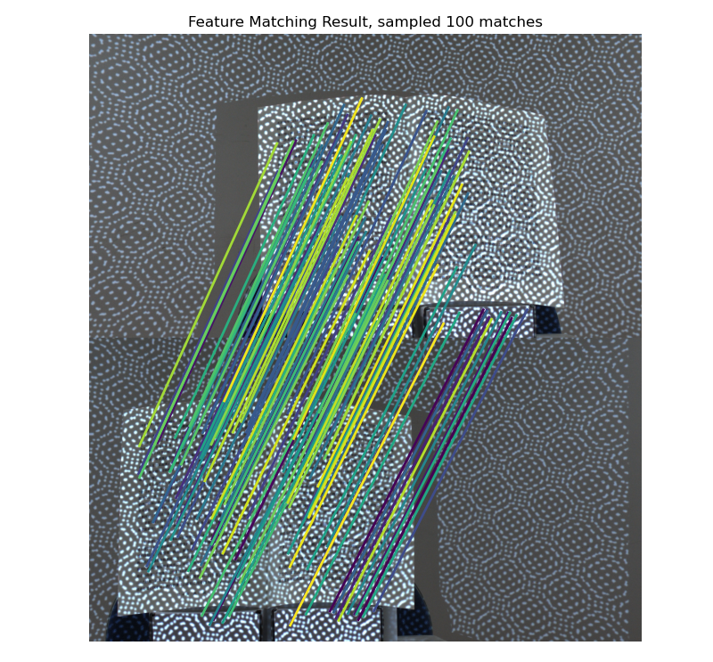

## Task 3: Reprojection Rendering & Warp
0. Task Details: Given the depth from Step 1 and the right-camera pose from Step 2, we can perform reprojection rendering to evaluate the earlier steps:

    1) Use the depth map to back-project the left-camera image into a point cloud (already done in Task 1).

    2) Render this point cloud from the right-camera viewpoint (existing rasterization tools can be used). Compare the rendered result with the actual right-camera image. Which distortions are caused by occlusion, and which are due to estimation error?

    3) Project the left-camera back-projected point cloud onto the right-camera pixel coordinates, then sample the right-camera image using those pixel coordinates to “reconstruct” the left-camera image (this operation is called warping). How different is the reconstruction from the real captured image?

    4) Use the more accurate depth estimated with alacarte_32 for reprojection. Compare the result.

1. Implementation details:

    - Using the point cloud obtained in Task 1, I used [__pyrender__](https://pyrender.readthedocs.io/en/latest/) to render it from the right-camera viewpoint, obtaining the rendered right image.

    - I then resampled the right image to obtain the warped left image.

2. Rendered right camera image (using depth estimated with single-shot image No. 1)


3. Rendered right camera image (using depth estimated with 32 alacarte images)

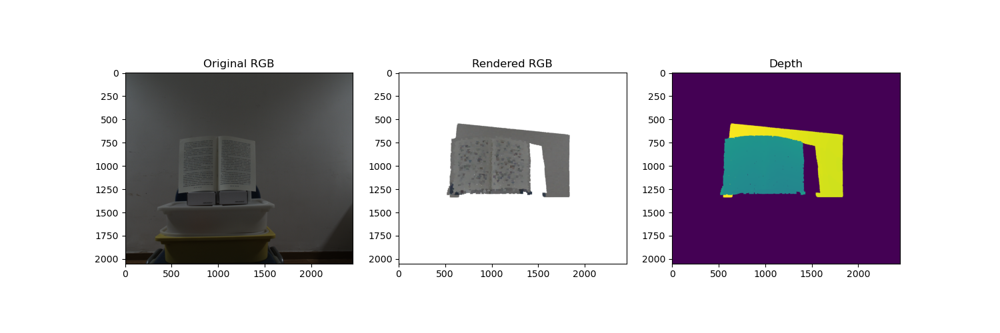

4. Other objects rendered from the right-camera viewpoint (using depth estimated with 32 alacarte images):

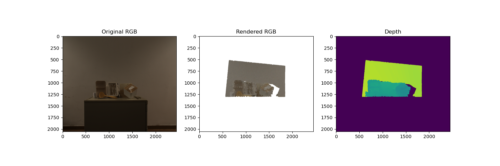
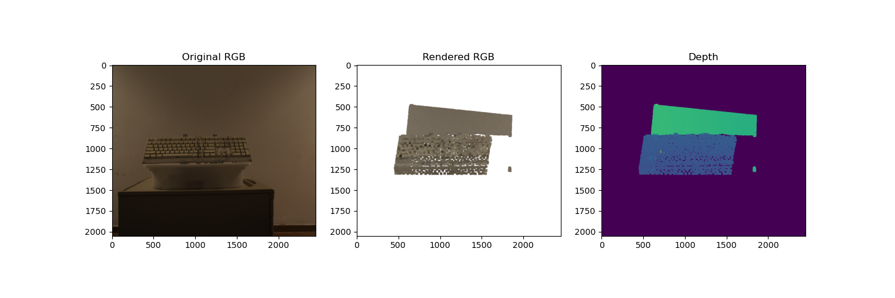

5. Warped left camera image (using depth estimated with single-shot image No. 1)

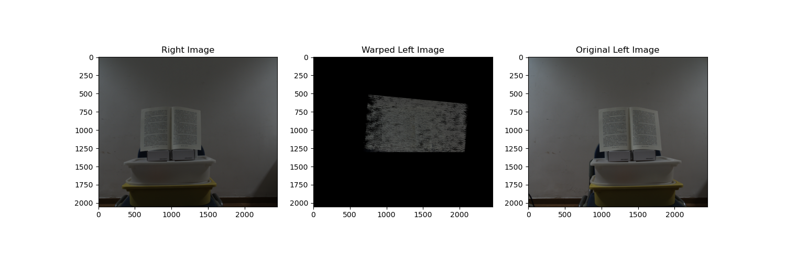

6. Warped left camera image (using depth estimated with 32 alacarte images)

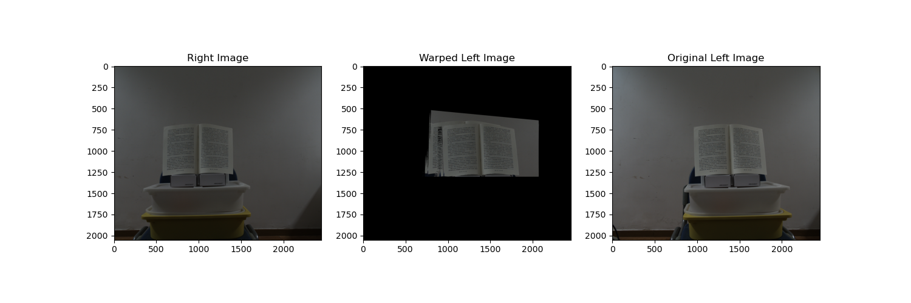

7. Other objects warped from the left-camera viewpoint (using depth estimated with 32 alacarte images):

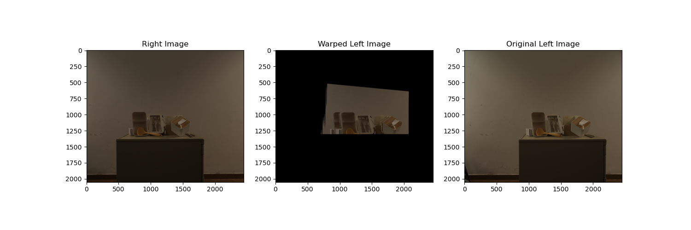
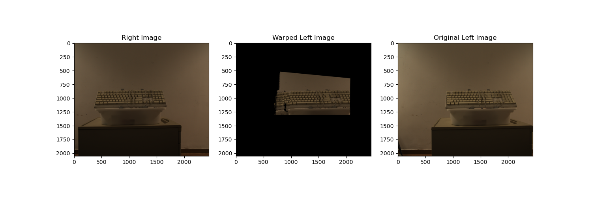

